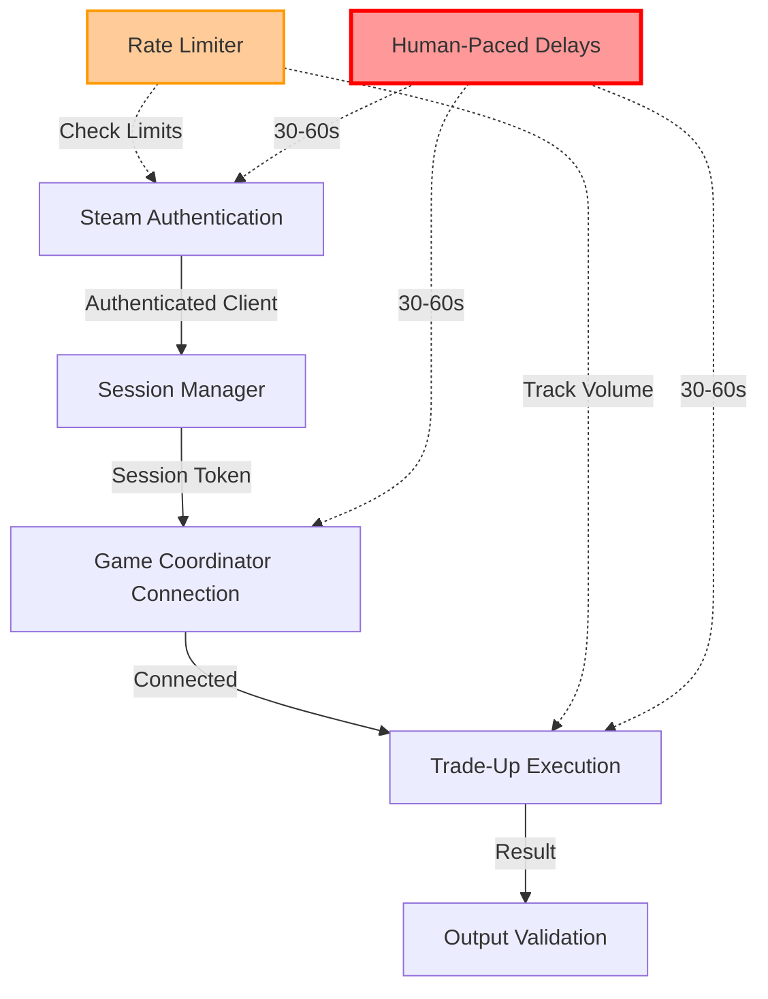
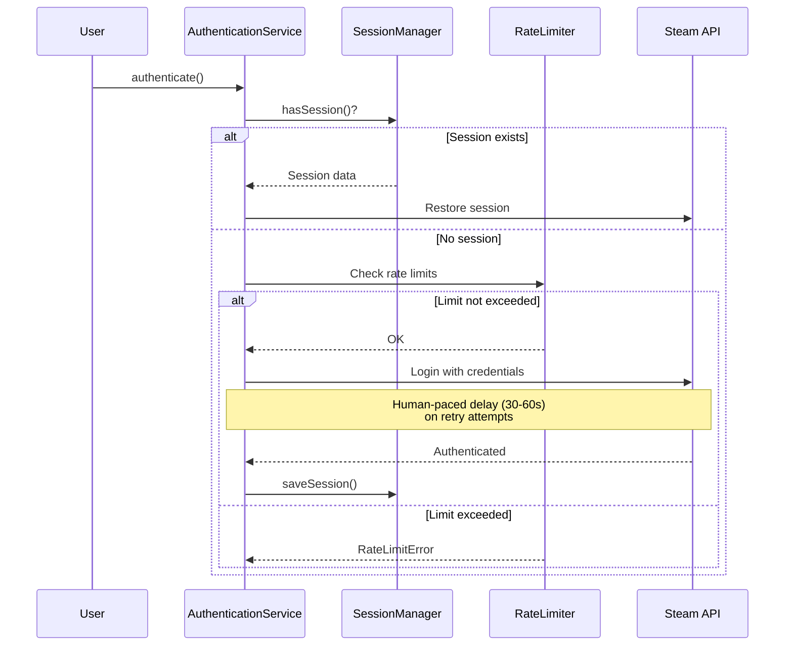
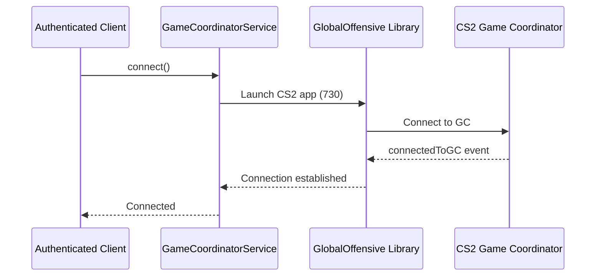
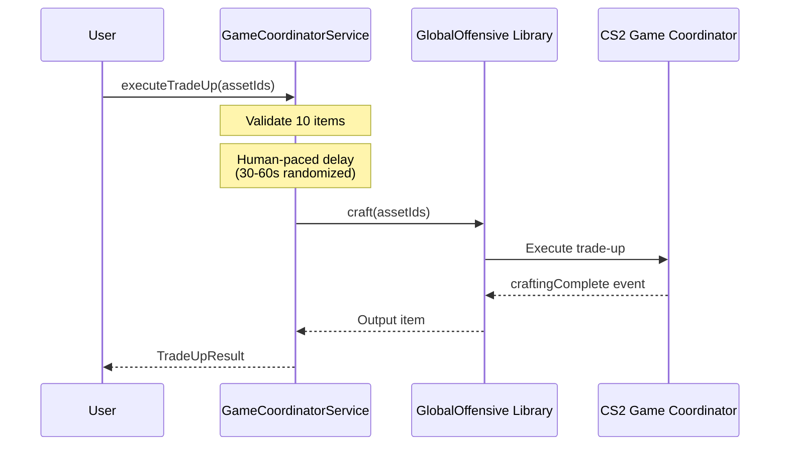

# Integration Workflow Documentation

**Last Updated**: 2025-11-02
**Status**: Phase 3 Complete - Walking Skeleton Validated

## Overview

This document describes the complete end-to-end integration workflow for the CS2 Trade-Up Educational Bot, demonstrating how all components work together to achieve automated trade-up execution with ban mitigation strategies.

## Architecture Overview



## Component Integration

### 1. Authentication Service (`src/auth/`)

**Purpose**: Authenticate with Steam using credentials and 2FA.

**Key Features**:

- Retry logic with exponential backoff
- 2FA support via shared secret (steam-totp)
- Human-paced delays (30-60s) between authentication attempts
- Session token persistence for password-less reconnection

**Integration Points**:

- **Input**: Steam credentials (username, password, shared secret)
- **Output**: Authenticated SteamUser client
- **Dependencies**: SessionManager, RateLimiter

**Human-Paced Delays**:

- **Between retries**: 30-60s (randomized)
- **Purpose**: Prevent Steam ban detection

### 2. Session Manager (`src/auth/SessionManager.ts`)

**Purpose**: Persist and restore Steam session tokens to avoid repeated authentication.

**Key Features**:

- Save session tokens to `/data/session.json`
- Restore sessions on container restart
- Secure file permissions (600)
- Automatic session expiration detection

**Integration Points**:

- **Input**: SessionData (accountName, steamId, savedAt)
- **Output**: Restored session or null
- **Storage**: `/data/session.json` (persistent volume)

**Ban Mitigation**: Reduces authentication frequency by reusing valid sessions.

### 3. Rate Limiter (`src/auth/RateLimiter.ts`)

**Purpose**: Track and enforce daily/monthly limits on authentication attempts and trade-up crafts.

**Key Features**:

- Daily authentication limit: 10 attempts (default)
- Monthly authentication limit: 100 attempts (default)
- Volume tracking in `/data/volume.json`
- Automatic daily/monthly rotation

**Integration Points**:

- **Input**: Authentication attempts, craft executions
- **Output**: Limit exceeded flag
- **Storage**: `/data/volume.json` (persistent volume)

**Ban Mitigation**: Prevents excessive automation that triggers Steam detection.

### 4. Game Coordinator Service (`src/gamecoordinator/`)

**Purpose**: Connect to CS2 Game Coordinator and execute trade-up contracts.

**Key Features**:

- GC connection lifecycle management
- Human-paced delays (30-60s) before operations
- Trade-up execution via `craft()` method
- Input validation (exactly 10 items)

**Integration Points**:

- **Input**: Authenticated SteamUser client, asset IDs (10 items)
- **Output**: Trade-up result with output item
- **Dependencies**: steam-user, node-globaloffensive

**Human-Paced Delays**:

- **Before inventory requests**: 30-60s (randomized)
- **Before trade-up execution**: 30-60s (randomized)
- **Purpose**: Mimic human gameplay patterns

## Complete Workflow Sequence

### Phase 1: Authentication



### Phase 2: Game Coordinator Connection



### Phase 3: Trade-Up Execution



## Human-Paced Delay Implementation

### Purpose

Human-paced delays are the **PRIMARY ban mitigation strategy**. They ensure the bot behaves like a human player, preventing Steam's automated detection systems from flagging the account.

### Delay Specifications

| Operation              | Delay Range | Randomization | Purpose                        |
| ---------------------- | ----------- | ------------- | ------------------------------ |
| Authentication retries | 30-60s      | +0-20% jitter | Prevent rapid login attempts   |
| GC connection          | 30-60s      | +0-20% jitter | Mimic manual CS2 launch        |
| Inventory requests     | 30-60s      | +0-20% jitter | Avoid API abuse detection      |
| Trade-up execution     | 30-60s      | +0-20% jitter | Mimic manual contract creation |

### Implementation Details

```typescript
// Example: Human-paced delay implementation
const baseDelay = Math.random() * (maxDelay - minDelay) + minDelay; // 30000-60000ms
const jitter = baseDelay * 0.2 * Math.random(); // 0-20% additive jitter
const actualDelay = baseDelay + jitter; // Always >= minDelay

console.log(`[CRITICAL] Implementing human-paced delay of ${Math.round(actualDelay / 1000)}s`);
await new Promise((resolve) => setTimeout(resolve, actualDelay));
```

**Critical Rules**:

1. **Never bypass delays** - They are mandatory for ban prevention
2. **Never reduce delays** - Minimum 30s is required
3. **Always randomize** - Prevent pattern detection
4. **Log delays** - For auditing and verification

## Integration Testing

### Test Suite: `tests/integration.test.ts`

The integration test suite validates the complete workflow with mocked Steam APIs:

**Test Scenarios**:

1. **Full GC workflow with delays**: Validates complete GC connection → trade-up → disconnection flow
2. **Delay enforcement**: Verifies all operations apply human-paced delays
3. **Error handling**: Tests timeout and connection failure scenarios
4. **Production delay documentation**: Documents 30-60s production delay requirements
5. **Delay randomization**: Validates delays are randomized to avoid patterns
6. **Walking skeleton**: Minimal viable flow validation

**Running Tests**:

```bash
# Run integration tests
npm test tests/integration.test.ts

# Run all tests
npm test

# Run with coverage
npm run test:coverage
```

**Expected Results**:

- ✅ All 6 integration tests passing
- ✅ All 131+ unit/integration tests passing (100%)
- ✅ Human-paced delays verified

## Error Handling & Recovery

### Connection Failures

**Scenario**: GC connection timeout after 30 seconds

**Handling**:

```typescript
try {
  await gcService.connect();
} catch (error) {
  if (error instanceof GameCoordinatorError) {
    console.error('GC connection failed:', error.message);
    // Retry with exponential backoff
  }
}
```

### Authentication Failures

**Scenario**: Invalid Steam credentials or rate limit exceeded

**Handling**:

```typescript
try {
  await authService.authenticate();
} catch (error) {
  if (error instanceof RateLimitError) {
    console.error('Rate limit exceeded - wait before retry');
  } else if (error instanceof TwoFactorError) {
    console.error('2FA required - check shared secret');
  }
}
```

### Trade-Up Failures

**Scenario**: Trade-up execution timeout or validation failure

**Handling**:

```typescript
try {
  const result = await gcService.executeTradeUp(assetIds);
} catch (error) {
  if (error.code === 'TRADEUP_VALIDATION_FAILED') {
    console.error('Invalid input - check asset IDs and count');
  } else if (error.code === 'TRADEUP_TIMEOUT') {
    console.error('Trade-up timed out - GC may be unavailable');
  }
}
```

## Production Deployment

### Environment Variables

```bash
# Steam Credentials
STEAM_USERNAME=your_test_account
STEAM_PASSWORD=your_password
STEAM_SHARED_SECRET=your_2fa_secret

# Rate Limits
MAX_DAILY_AUTH_ATTEMPTS=10
MAX_MONTHLY_AUTH_ATTEMPTS=100

# Human-Paced Delays (DO NOT REDUCE)
RETRY_DELAY_MIN=30000  # 30 seconds
RETRY_DELAY_MAX=60000  # 60 seconds
```

### Docker Deployment

```bash
# Build container
docker-compose build

# Start bot
docker-compose up -d

# View logs
docker-compose logs -f

# Stop bot
docker-compose down
```

### Persistent Data

- **Session tokens**: `/data/session.json` (auto-created)
- **Rate limit tracking**: `/data/volume.json` (auto-created)
- **Logs**: Console output (redirect to file if needed)

## Ban Mitigation Summary

### Critical Controls (MUST NOT DISABLE)

1. ✅ **Human-Paced Delays**: 30-60s randomized delays on all operations
2. ✅ **Rate Limiting**: Daily/monthly volume limits enforced
3. ✅ **Session Persistence**: Reduce authentication frequency
4. ✅ **Delay Randomization**: Prevent pattern detection

### Additional Best Practices

- Use a dedicated test account (isolated from main account)
- Keep volume low (12-100 crafts/month recommended)
- Monitor Steam ToS changes and enforcement actions
- Document educational purpose clearly
- Never run multiple bots from same IP

## Troubleshooting

### Issue: Tests fail with connection timeout

**Solution**: Increase `connectionTimeout` in test configuration or check mock setup.

### Issue: Authentication fails repeatedly

**Solution**: Verify Steam credentials and 2FA shared secret in environment variables.

### Issue: Rate limit exceeded

**Solution**: Wait for daily/monthly rotation or increase limits (not recommended).

### Issue: Trade-up validation fails

**Solution**: Ensure exactly 10 asset IDs provided and all are non-empty strings.

## Next Steps

- **Phase 4 (PoC Validation)**: End-to-end validation with real Steam test account
- **Phase 5 (Full-Cycle Automation)**: EV calculation, float optimization, market integration
- **Phase 6 (Risk Management)**: Enhanced rate limiting, profit tracking, risk controls
- **Phase 7 (Educational Content)**: Documentation, risk assessment frameworks, tutorials

## References

- [Steam ToS](https://store.steampowered.com/subscriber_agreement/)
- [CS2 Trade-Up Contracts](https://counterstrike.fandom.com/wiki/Trade_Up_Contract)
- [steam-user Documentation](https://github.com/DoctorMcKay/node-steam-user)
- [node-globaloffensive Documentation](https://github.com/DoctorMcKay/node-globaloffensive)
- [Ban Mitigation Strategies](.holicode/analyse/reports/mitigation-to-avoid-steam-ban-in-eductional-bot.md)
